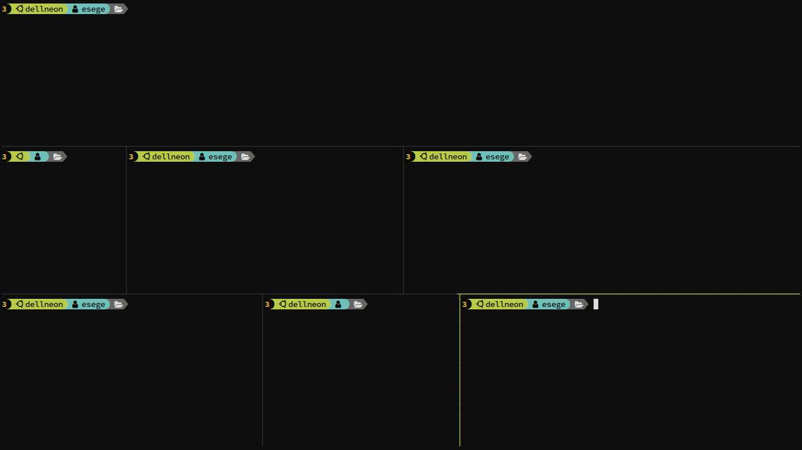
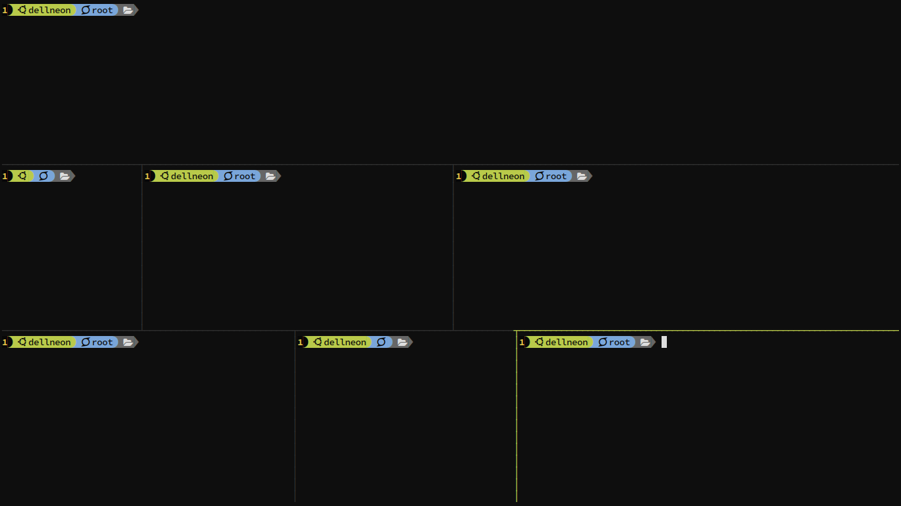
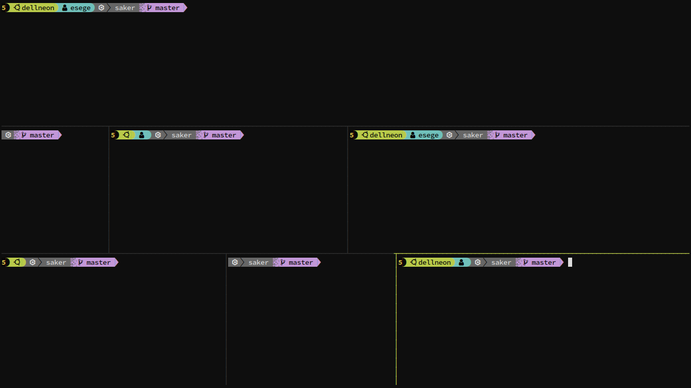
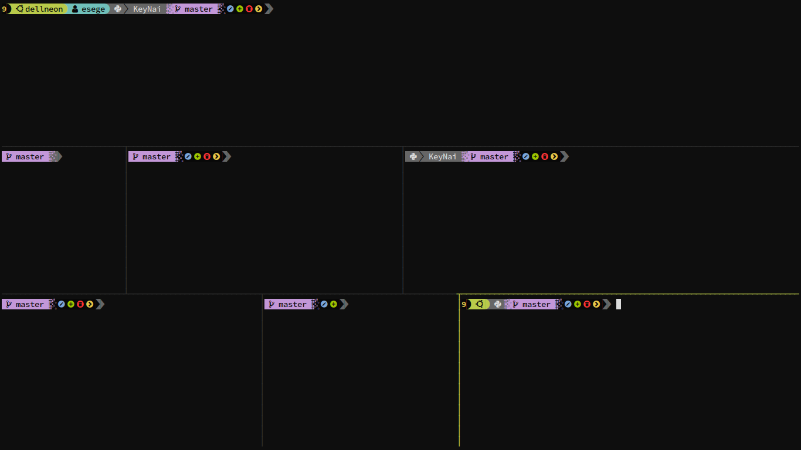
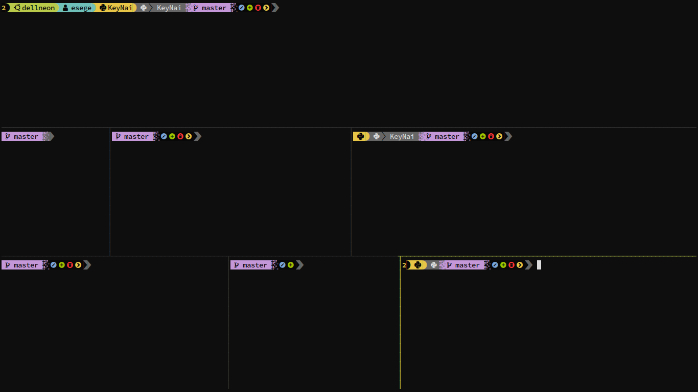
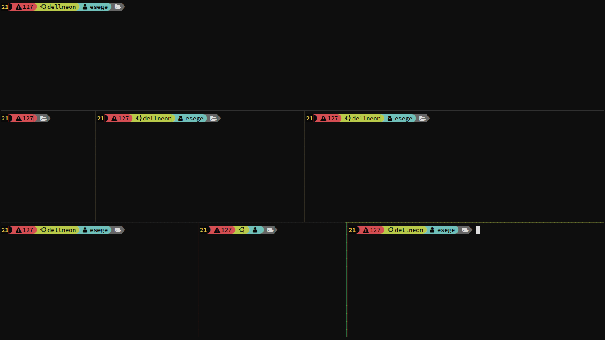

# Welcome to saker 👋

[](#)

> a bash prompt written in C++, also intended to be a library for writing fast prompts

### Motivation

The motivation behind this was my love for the terminal, and those fancy looking prompts, yet i didn't want to bother writing those prompts inside my
.bashrc, they are really annoying to write and modify, i also wanted some dynamic behaviour regarding the size of the prompt, so it doesn't feel out of
place in smaller terminals or multiplexer panes.

### Why C++?

Could've as well been written in any other language, but i didn't want it to be slow despite it having to retrieve lots of information, and I enjoy
programming in C++.

## It adapts to your terminal size



## Identify other users without loosing style



## Assign icons to directories


## Git branch on project directory



## Git status indicators



## Virtual environment info



## Get background tasks and error codes




## Install

### Prerequisites

A [nerd font](https://www.nerdfonts.com) for those nice icons

in case you want it to look just as mine please install [FunctionalPlus](https://github.com/Dobiasd/FunctionalPlus)
it is not strictly necessary as you can customize the behaviour, but i purposely made the content accept vectors with that library in mind, give it a try.

```sh
git clone https://github.com/esegere/saker 
cd saker 
mkdir build 
cd build  
cmake -DCMAKE_BUILD_TYPE=Release .. 
sudo make install
```

## Usage

add

```sh
# virtualenv info
function virtualenv_info() {
    # Get Virtual Env
    if [[ -n "$VIRTUAL_ENV" ]]; then
        # Strip out the path and just leave the env name
        echo "${VIRTUAL_ENV}" | awk -F / '{print $(NF)}'
    else
        # In case you don't have one activated
        echo ''
    fi
}

# disable the default virtualenv prompt change
export VIRTUAL_ENV_DISABLE_PROMPT=1

export $PS1='`saker-prompt -l=\# -e="$?" -j=\j -xc=$(virtualenv_info) -xi=""``'
```

to your **.bashrc** file

Customization settings go under the **userdata.hpp file**, there you can define your extra functionality, if any parameter is needed prom the commad
line you can use the **argh::parser**  to retrieve those values and modify your **.bashrc** accordingly

general behaviour and structure can be modified in **main.cpp** youre free to experiment, just avoid touching files inside **include** for your own sanity

## Authors

👤 **Sergio Garcia**

* Github: [@esegere](https://github.com/esegere)
* LinkedIn: [@sogarciar](https://linkedin.com/in/sogarciar)

👤 **Cesar Pérez** - designer of saker cool logo

* Behance: [csr-dg](https://www.behance.net/csr-dg)
* Instagram: [csr_dg](https://www.instagram.com/csr_dg)

## Show your support

Give a ⭐️ if this project helped you!

also give a ⭐️ to

- [rang](https://github.com/agauniyal/rang)
- [argh](https://github.com/adishavit/argh)

without them this would´ve been a ton more difficult and discouraging as this project relies on those libraries to implement some nice functionality

***

_This README was generated with ❤️ by [readme-md-generator](https://github.com/kefranabg/readme-md-generator)_
